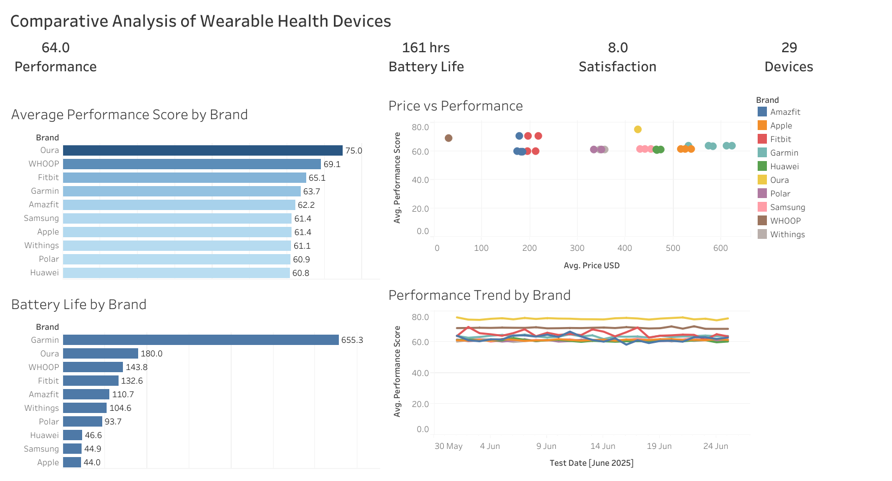

# Comparative Analysis of Wearable Health Devices

## Overview

This project presents an interactive Tableau dashboard for comparing wearable health devices across multiple performance metrics. The dashboard enables users to evaluate brands based on performance score, battery life, pricing, user satisfaction, and performance trends over time.

---

## Key Insights

- Oura achieved the highest average performance score (75.0).
- Garmin devices delivered the highest average battery life.
- Premium-priced devices generally achieved higher performance scores.
- User satisfaction remained consistently high across major brands.

---

## Dashboard Preview

---

## Dashboard Features

- KPI cards summarizing key metrics
- Performance comparison across brands
- Price vs Performance analysis
- Battery Life comparison
- Performance trends over time
- Interactive filtering

---

## Key Insights

- Oura achieved the highest average performance score.
- Garmin devices demonstrated exceptional battery life.
- Higher prices did not always correspond to better performance.
- Performance remained relatively stable across the testing period.

---

## Tools Used

- Tableau Public
- CSV Dataset
- Dashboard Design
- Business Intelligence
- Data Visualization

---

## Tableau Public Dashboard

https://public.tableau.com/app/profile/romi.das/viz/ComparativeAnalysisofWearableHealthDevices/Dashboard1

---

## Repository Contents

- dashboard.png
- wearable_health_devices_performance_upto_26june2025.csv
- Comparative Analysis of Wearable Health Devices.twbx

---

## Dataset

The dataset used in this project was obtained from the Wearable Health Device Performance Data 2025 dataset on Kaggle.

https://www.kaggle.com/datasets/pratyushpuri/wearable-health-devices-performance-analysis/data

The data was cleaned, transformed, and organized into multiple fact tables using Power Query before building the dashboard.

This project is intended for educational and portfolio purposes.

---

## Skills Demonstrated

- Tableau Public
- Dashboard Design
- KPI Design
- Interactive Filtering
- Data Visualization
- Business Intelligence
- Exploratory Data Analysis
